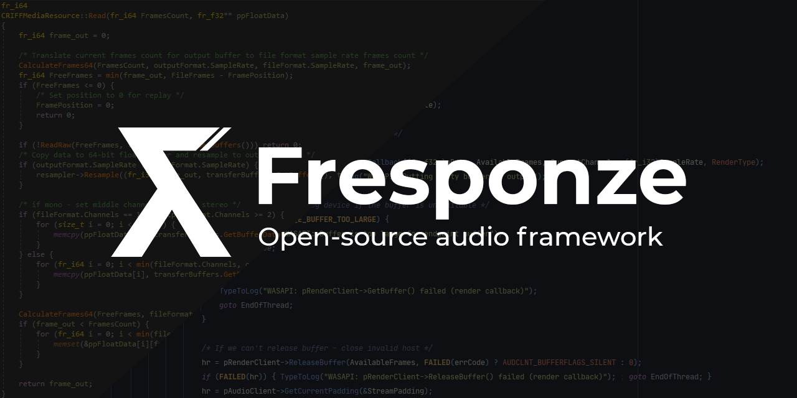

# Fresponze

Version 1.0a is here! What's new:
* ALSA, CoreAudio Endpoint
* A lot of fixes
* CMake Build system
* Documentation on Docusaurus 2.0
* Updated Mixer system

Fast, simple and modern middleware for game engines

# Features
This library lets you write audio without any problems with system audio in C or C++ that
will compile and run on Windows, macOS and Linux. 

# Used libraries
* [Resonance Audio](https://github.com/resonance-audio/resonance-audio)
* [R8Brain](https://github.com/avaneev/r8brain-free-src)
* [Opus](https://github.com/xiph/opus)
* [Opusfile](https://github.com/xiph/opusfile)
* [OGG](https://github.com/xiph/ogg)
* [ImGui (for examples)](https://github.com/ocornut/imgui)
* [Some code from WebRTC](https://chromium.googlesource.com/external/webrtc/)

# Audio backends
* WASAPI (100%, finished)
* ALSA (15%, in development)
* XAudio2 (10%, in development)
* AAudio (0%, in development)
* AVAudioEngine (0%, in development)
* CoreAudio (0%, in development)
* PortAudio (0%, in development)
* PlayStation 4/5 (0%, in development, for verified developers)
* Xbox One/SX (0%, in development, for verified developers)

We don't want to add DirectSound, WinMM and etc. because...
* We don't like to support legacy code
* [PortAudio](http://www.portaudio.com/)

# Current state
In development, pre-alpha 

# License
Apache-2. See "LICENSE" file for more information.
